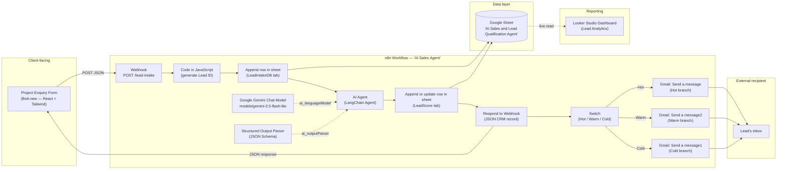
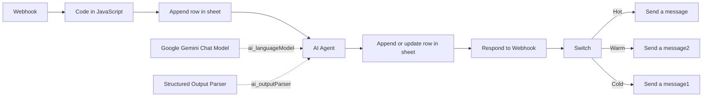
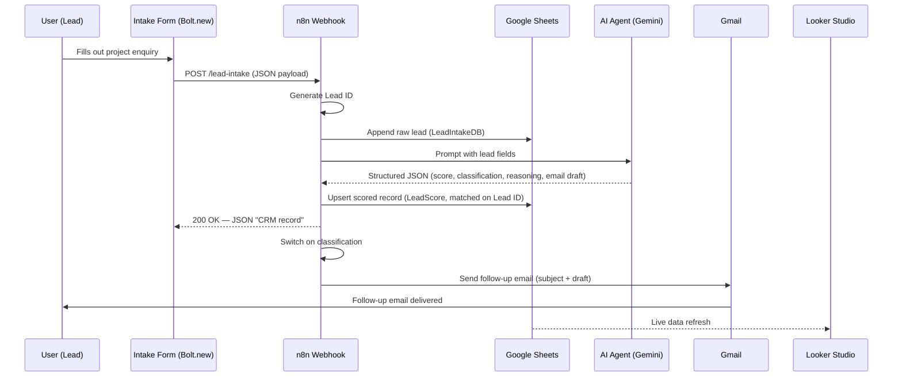
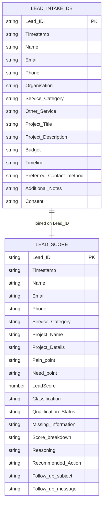

# Architecture Diagram — AI Sales and Lead Qualification Agent

This document describes the full system architecture: the public intake form, the n8n orchestration backend, the AI reasoning layer, data storage, notification, and reporting. Diagrams are written in [Mermaid](https://mermaid.js.org/) — they render natively on GitHub, GitLab, Notion, and most modern Markdown viewers. If your viewer doesn't render Mermaid, paste the code blocks into the [Mermaid Live Editor](https://mermaid.live).

---

## 1. Component overview

---

## 2. n8n node graph (matches the imported workflow exactly)

> This mirrors the node names and connections found in `AI_Sales_Agent.json` exactly, so it can be used to sanity-check the workflow after import.

---

## 3. Request/response sequence for one lead

---

## 4. Data model

---

## 5. Layer responsibilities

| Layer | Technology | Responsibility |
|---|---|---|
| **Presentation** | Bolt.new (React + Tailwind + Lucide) | Collects structured lead input from a public form; POSTs JSON to the webhook; displays confirmation. |
| **Orchestration** | n8n | Owns the pipeline: intake logging, AI invocation, result persistence, response, routing, email dispatch. |
| **Reasoning** | Google Gemini (`gemini-3.5-flash-lite`) via LangChain Agent node | Scores, classifies, explains, and drafts a follow-up — constrained to a fixed JSON Schema. |
| **Validation** | Structured Output Parser (JSON Schema) | Guarantees the AI's output always has the fields every downstream node expects. |
| **Persistence** | Google Sheets (2 tabs: `LeadIntakeDB`, `LeadScore`) | System of record; append-only raw log + upserted scored record. |
| **Notification** | Gmail (OAuth2) | Delivers the AI-drafted follow-up to the lead, branch selected by classification. |
| **Reporting** | Looker Studio | Live dashboard reading directly from `LeadScore` — totals, average score, classification mix, score distribution, service-category mix. |

---

## 6. Why this shape

- **Single webhook entry point** keeps the form decoupled from the backend implementation — the form only needs to know one URL and POST JSON.
- **Raw log before AI processing** (`LeadIntakeDB`) means a lead is never lost even if the AI step or a downstream node fails.
- **Schema-constrained AI output** turns a free-text LLM into a reliable API contract that Sheets, the webhook response, and the dashboard can all consume without additional parsing.
- **Upsert-by-Lead-ID on the scored table** allows safe re-processing of the same lead without duplicating dashboard rows.
- **Dashboard reads the sheet, not the workflow** — reporting has zero coupling to n8n's runtime, so the dashboard stays live even if the workflow is edited or briefly deactivated.