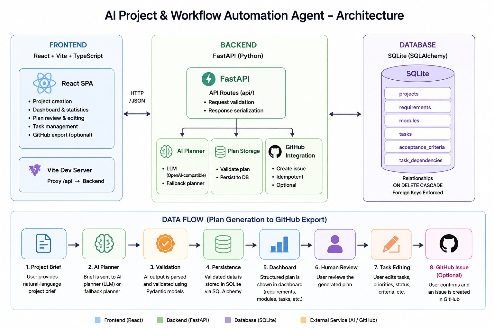

# AI Project & Workflow Automation Agent

An internal project planning and workflow automation application for
**Zenera Labs**. It turns a natural-language project brief into a structured,
editable project plan using AI.

## Project overview

A user pastes a project brief (e.g. *"Build an e-commerce application where
users can register, browse products, add products to a cart, and place
orders."*). The application:

1. Analyzes the brief with an LLM planning assistant.
2. Produces a **validated, structured plan**: project summary, requirements,
   modules, tasks with priorities and statuses, acceptance criteria, and task
   dependencies.
3. Stores the plan in SQLite.
4. Displays it in a **dashboard** where a human reviews, edits, and approves
   the tasks.
5. Optionally exports a reviewed task to a GitHub issue — only after explicit
   user confirmation.

## Problem statement

Project planning is typically manual and slow, and AI chat output is free-form
text that is hard to review, track, or act on. This tool makes AI *plan*, not
just *chat*: it converts briefs into **structured project data** (never raw
text), validates that data against strict schemas, persists it, and puts a
human-review workflow in front of it — so AI assists with planning without
blindly executing external actions.

## Features

- **Natural-language planning** — brief → structured `ProjectPlan` via
  Google's Gemini API (official `google-genai` SDK, free tier supported), with
  the reply validated by Pydantic before anything is stored.
- **Structured plan** — summary, requirements, modules, tasks (priority
  HIGH/MEDIUM/LOW, status TODO/IN_PROGRESS/BLOCKED/DONE), acceptance criteria,
  and dependency edges.
- **Validation** — required fields, priority values, data types, unique ids,
  resolvable module/requirement/task references, and a hard rule that a task
  cannot depend on itself (schema + database CHECK constraint).
- **Project home** — create a project from a name + brief and generate its plan
  in one action; list projects with live requirement/module/task counts.
- **Dashboard** — statistics cards, and Overview / Requirements / Modules /
  Tasks / Dependencies tabs with task filtering by priority, status, and
  module. Tabs are deep-linkable via `?tab=`.
- **Task review & editing** — every task shows an "AI-generated, editable"
  notice; title, description, priority, status, and acceptance criteria can be
  edited and persist across reloads.
- **Reliability** — friendly error messages for empty/short/long briefs, AI
  failures, timeouts, invalid AI output, database failures, and missing
  resources; raw stack traces are never shown to users.
- **GitHub export (optional)** — create a GitHub issue from a reviewed task
  with explicit user confirmation; the issue URL is stored on the task.
- **Deterministic development fallback** — with `AI_USE_FALLBACK=1`, plans are
  generated locally without any API key, so the whole stack is testable offline.

## Architecture


See [docs/architecture.md](docs/architecture.md) for details.

## Technology stack

| Layer | Technology |
| --- | --- |
| Frontend | React 19, Vite 8, TypeScript, react-router-dom 7, plain CSS |
| Backend | Python 3.9+, FastAPI, Pydantic v2, SQLAlchemy 2.x |
| Database | SQLite (dev file `app.db`, tests use in-memory) |
| AI | Google Gemini API via the official `google-genai` SDK (default model `gemini-3.5-flash`) |
| GitHub | GitHub REST API via standard-library `urllib` |
| Testing | Pytest (backend), TypeScript + oxlint + Vite build (frontend) |

## Project structure

```
ai-project-workflow-automation-agent/
├── backend/                 # FastAPI application
│   ├── app/
│   │   ├── main.py          # Entrypoint; DB init on startup; global error handlers
│   │   ├── database.py      # Engine, session factory, init_db, SQLite FK enforcement
│   │   ├── models.py        # SQLAlchemy ORM models
│   │   ├── schemas.py       # Pydantic plan + API schemas, validation
│   │   ├── api/
│   │   │   ├── projects.py  # Project + plan routes
│   │   │   ├── tasks.py     # Task update/delete + GitHub issue routes
│   │   │   └── serializers.py
│   │   └── services/
│   │       ├── ai_planner.py       # Real AI planner + error types
│   │       ├── prompts.py          # Planner prompts
│   │       ├── fallback_planner.py # Deterministic dev fallback
│   │       ├── plan_storage.py     # Plan -> DB persistence + regeneration
│   │       └── github_integration.py
│   ├── requirements.txt
│   └── requirements-dev.txt # + pytest, httpx (for TestClient)
├── frontend/                # React + Vite + TypeScript
│   └── src/
│       ├── api.ts           # Typed fetch client
│       ├── types.ts         # API response types
│       ├── App.tsx          # Router
│       ├── pages/           # HomePage, DashboardPage, TaskReviewPage
│       └── components/      # Layout, forms, tables, badges, tabs, spinner
├── tests/                   # Pytest suites (see docs/testing.md)
├── docs/                    # architecture.md, api.md, testing.md
├── .gitignore
├── .env.example
└── README.md
```

## Prerequisites

- Python 3.9+
- Node.js 20+ and npm

## Setup

```bash
# 1. Backend environment
cd ai-project-workflow-automation-agent
python3 -m venv .venv
source .venv/bin/activate
pip install -r backend/requirements-dev.txt

# 2. Frontend dependencies
cd frontend
npm install
cd ..
```

## Environment variables

Copy `.env.example` to `.env` and fill in real values. Nothing is required for
the fallback-only flow; `AI_LLM_API_KEY` (a Gemini API key) is required for
real Gemini planning.

| Variable | Default | Purpose |
| --- | --- | --- |
| `DATABASE_URL` | `sqlite:///./app.db` | SQLite database file (relative to the uvicorn working directory) |
| `AI_LLM_API_KEY` | — | Gemini API key (real planner), from https://aistudio.google.com/apikey |
| `AI_LLM_BASE_URL` | (Google default) | Optional override for the Gemini API endpoint (e.g. a proxy) |
| `AI_LLM_MODEL` | `gemini-3.5-flash` | Gemini model used for planning |
| `AI_LLM_TIMEOUT_SECONDS` | `60` | AI request timeout |
| `AI_USE_FALLBACK` | `0` (unset) | `1` = fallback planner only; `0`/unset = Gemini first, automatic fallback on failure |
| `GITHUB_TOKEN` | — | PAT with `repo` scope (optional GitHub export) |
| `GITHUB_REPO` | — | Sandbox repo, e.g. `zeneralabs/sandbox` |
| `GITHUB_API_BASE_URL` | `https://api.github.com` | GitHub API base URL override |

## Running the backend

```bash
# From the repository root:
source .venv/bin/activate
uvicorn app.main:app --reload --port 8000 --app-dir backend

# (or from backend/:)
# cd backend && uvicorn app.main:app --reload --port 8000
```

The database file is created automatically on startup. Interactive API docs:
`http://localhost:8000/docs`.

## Running the frontend

```bash
cd frontend
npm run dev
```

Open `http://localhost:5173`. The dev server proxies `/api` to the backend at
`http://127.0.0.1:8000` — start the backend first. For local planning without
an API key, start the backend with `AI_USE_FALLBACK=1`.

Production build (static files go to `frontend/dist/`):

```bash
cd frontend
npm run build
```

## Database setup

- Tables are created automatically on startup (`init_db()`); there is no
  migration tool.
- SQLite foreign key enforcement is enabled per connection.
- Child rows cascade on delete; a task cannot depend on itself
  (`ck_task_no_self_dependency` CHECK constraint).
- **Schema changes:** delete `app.db` (or set a new `DATABASE_URL`) so tables
  are recreated — e.g. after the Phase 12 `github_issue_url` column was added.

## AI configuration

Set `AI_LLM_API_KEY` (a Gemini API key from https://aistudio.google.com/apikey)
and optionally `AI_LLM_BASE_URL` / `AI_LLM_MODEL` / `AI_LLM_TIMEOUT_SECONDS`
to use the real planner. It uses Google's official Gemini API via the
`google-genai` SDK:

1. Sends the brief plus a strict output schema to the model with
   `response_mime_type="application/json"` and a low temperature (0.2).
2. Parses the JSON reply and validates it against `ProjectPlan` (Pydantic).
3. Rejects empty content, invalid JSON, or schema-invalid output — the invalid
   output is **never stored**.

The prompt (`backend/app/services/prompts.py`) instructs the model to produce
an implementation-oriented plan grounded in the brief: 3–8 requirements and
3–8 modules depending on complexity, specific/actionable tasks with
priorities, statuses, and 1–3 verifiable acceptance criteria each, unique ids
with resolvable module/requirement/task references, and dependencies that
reflect realistic implementation order (e.g. database schema → auth API →
auth UI → protected dashboard). The model must return **only** the JSON
object — markdown, prose, or code fences are rejected.

### Automatic fallback

- `AI_USE_FALLBACK=0` (or unset): try Gemini first. If Gemini fails — missing
  or invalid key, authentication error, quota/rate limit, timeout, network
  error, provider error, malformed JSON, or schema-invalid output — the
  failure is **logged internally** and the existing deterministic fallback
  planner is used automatically. The API still returns a valid, validated
  plan (no error is shown to the user).
- `AI_USE_FALLBACK=1`: skip Gemini entirely and use the fallback planner only.

Database/persistence errors, invalid request data, and unrelated application
exceptions never trigger the fallback and are surfaced as before (`503` /
`422`). API keys and provider error details are never exposed to the
frontend.

### Running with the real AI

```bash
# 1. Get a free Gemini API key: https://aistudio.google.com/apikey
# 2. From the repository root, copy .env.example to .env and set:
cp .env.example .env
#   AI_USE_FALLBACK=0
#   AI_LLM_API_KEY=<your Gemini API key>   (never commit it)
#   AI_LLM_MODEL=gemini-3.5-flash          (or another supported model)

.venv/bin/uvicorn app.main:app --reload --port 8000 --app-dir backend

# Terminal 2 — frontend
cd frontend && npm run dev
```

Open `http://localhost:5173`, create a project, paste a brief, and click
**Generate Project Plan**. If Gemini succeeds you get the Gemini plan; if it
fails for any reason the app logs the failure and returns a fallback plan —
so plan generation keeps working without paid credits.

### Running with the fallback

```bash
AI_USE_FALLBACK=1 .venv/bin/uvicorn app.main:app --reload --port 8000 --app-dir backend
```

The deterministic fallback (`backend/app/services/fallback_planner.py`) is
explicitly separated from the real planner and is intended for local testing
without an API key. It is **not** a substitute for real AI output.

## API overview

Base URL: `http://localhost:8000`. All routes are under `/api` except the
service endpoints. Full reference: [docs/api.md](docs/api.md).

| Method | Path | Description |
| --- | --- | --- |
| `GET` | `/` | Service metadata |
| `GET` | `/health` | Health check |
| `POST` | `/api/projects` | Create a project |
| `GET` | `/api/projects` | List projects (with child counts) |
| `GET` | `/api/projects/{id}` | Get a project |
| `POST` | `/api/projects/{id}/generate-plan` | Generate + store an AI plan |
| `GET` | `/api/projects/{id}/plan` | Return the stored plan |
| `PUT` | `/api/tasks/{id}` | Update a task |
| `DELETE` | `/api/tasks/{id}` | Delete a task |
| `POST` | `/api/tasks/{id}/github-issue` | Create a GitHub issue (explicit action) |

Error responses are always `{"detail": "<friendly message>"}` — never stack
traces. Validation errors return `422`, missing resources `404`, AI/GitHub
failures `502`, database failures `503`.

## Testing

```bash
# Backend (from the repository root)
.venv/bin/pytest tests/

# Frontend
cd frontend && npm run lint && npm run build
```

The suite covers the database, schemas, AI planner, all API endpoints, error
handling, GitHub export, and complete end-to-end workflows. See
[docs/testing.md](docs/testing.md).

## Known limitations

- **Real Gemini not exercised live here** — the Gemini planner is fully
  unit-tested with a mocked client; a real Gemini API key + model are needed
  to verify a live model's output quality. The manual real-AI test below is
  the check to run once you have a key.

## Manual real-AI test

With a configured key and model, validate the planner end-to-end with this
brief:

```
Project Name: Smart Campus Event Management System

Build a web-based Smart Campus Event Management System for a college. Students
should be able to register and log in, view upcoming college events, search and
filter events, view event details, register for events, receive registration
confirmation, view their registered events, and cancel registrations. Event
organizers should be able to create, update, and delete events, set participant
limits, view registered participants, and track event participation. The system
must prevent duplicate registrations and prevent registration when an event is
full. It should show the number of available seats and provide clear validation
and error messages. An admin should be able to manage users and events. The
dashboard should display total events, upcoming events, total registrations, and
available seats.
```

```bash
# Terminal 1 — backend with the real AI (Gemini key from .env, never printed)
.venv/bin/uvicorn app.main:app --reload --port 8000 --app-dir backend

# Terminal 2 — frontend
cd frontend && npm run dev
```

Verify: project is created · requirements/modules/tasks generated · priorities
valid (HIGH/MEDIUM/LOW) · statuses valid (TODO/IN_PROGRESS/BLOCKED/DONE) ·
dependencies valid (no self/unknown references) · acceptance criteria present ·
dashboard displays the plan · task editing persists across reloads · GitHub
issue creation still works · invalid AI output is never stored. To verify
**automatic fallback**, set `AI_USE_FALLBACK=0` with an invalid/empty key and
confirm the plan still generates (the backend log shows "automatically using
the fallback planner").

```bash
# Or drive the same flow via curl (no key printed):
curl -s -X POST http://localhost:8000/api/projects -H 'Content-Type: application/json' \
  -d '{"name": "Smart Campus Event Management System"}'
curl -s -X POST http://localhost:8000/api/projects/1/generate-plan \
  -H 'Content-Type: application/json' -d @- <<'JSON'
{"brief": "Build a web-based Smart Campus Event Management System for a college. Students should be able to register and log in, view upcoming college events, search and filter events, view event details, register for events, receive registration confirmation, view their registered events, and cancel registrations. Event organizers should be able to create, update, and delete events, set participant limits, view registered participants, and track event participation. The system must prevent duplicate registrations and prevent registration when an event is full. It should show the number of available seats and provide clear validation and error messages. An admin should be able to manage users and events. The dashboard should display total events, upcoming events, total registrations, and available seats."}
JSON
```
- **Fallback planner is simple** — keyword-matched modules/tasks for local
  testing; it is not a substitute for real AI output.
- **Single-user, no authentication/authorization** (explicitly out of scope).
- **SQLite** — fine for an internal tool; not designed for concurrent
  multi-user workloads.
- **No schema migrations** — schema changes require deleting `app.db`.
- **GitHub export** — requires a personal access token and a sandbox repo;
  issue creation is GitHub-API-level (no OAuth web flow).
- **No pagination** on project/task lists (fine at internal-tool scale).
- **Automatic fallback is silent to the user** — when Gemini fails, the app
  logs the failure and returns a fallback plan; the user is not told which
  planner produced the plan.
- A plan exists only after generation; regenerating replaces the previous plan
  in full, so manual edits are lost on regeneration.

## Future improvements

- Validate real-model planning quality and tune the prompt/schema.
- Add authentication and per-user project ownership.
- Introduce Alembic migrations instead of recreating the database.
- Add plan export (Markdown/JSON) and a "regenerate" confirmation flow that
  preserves human edits.
- GitHub: OAuth-based auth, issue templates, and status sync back to tasks.
- Add plan versioning/diffing and richer dashboards (charts, burndown).
- Containerize the app for easy deployment.
