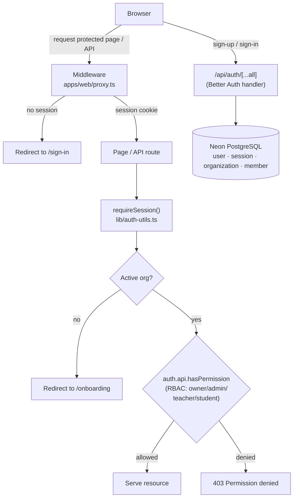
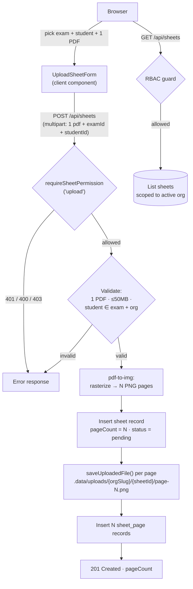
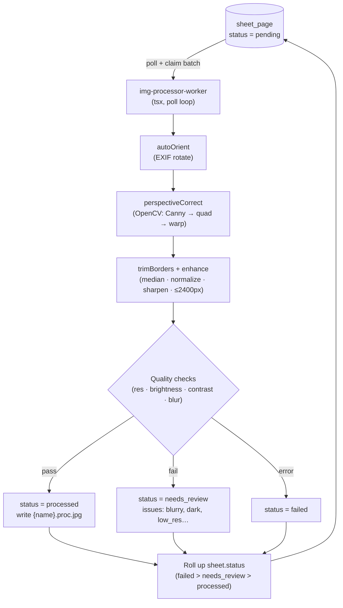
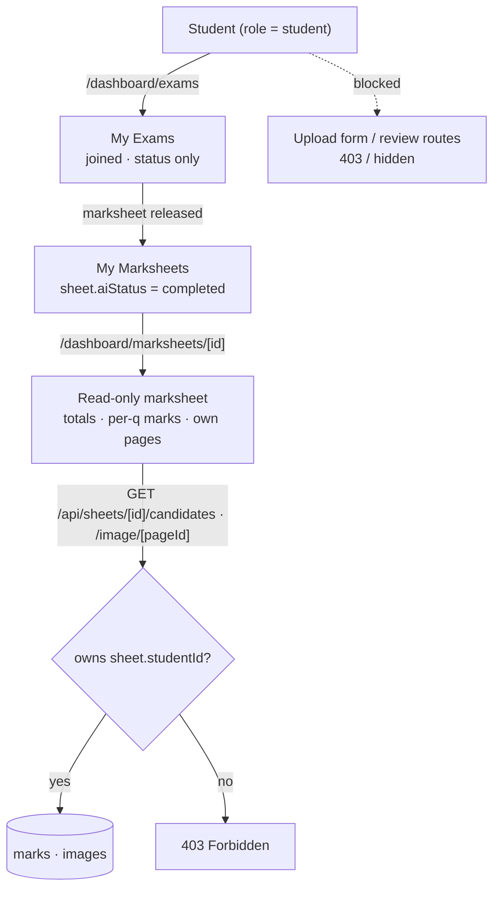
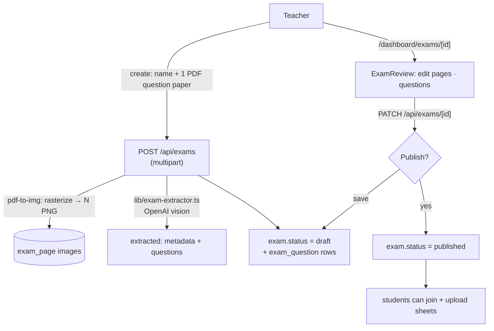

# AI EduMark

AI-powered answer sheet scanning and marks card automation platform. Built by Zenera Labs as a Turborepo monorepo.

## What's inside?

### Apps and Packages

- `apps/web`: [Next.js](https://nextjs.org/) 16 (App Router) web application
- `apps/img-processor-worker`: background worker that preprocesses uploaded answer sheets (sharp + OpenCV.js)
- `apps/ai-evals-worker`: background worker that evaluates preprocessed sheets with an OpenAI vision model (candidate marks + confidence)
- `packages/db`: shared Drizzle ORM schema + Neon PostgreSQL client (`@repo/db`)
- `packages/auth`: Better Auth configuration, client, and RBAC roles (`@repo/auth`)
- `packages/ui`: shared React component library (`@repo/ui`)
- `packages/eslint-config`: shared ESLint configurations
- `packages/typescript-config`: shared `tsconfig.json`s

Each package/app is 100% [TypeScript](https://www.typescriptlang.org/).

## Tech Stack

| Layer      | Technology                                    |
| ---------- | --------------------------------------------- |
| Framework  | Next.js 16 (App Router), React 19             |
| Monorepo   | Turborepo                                     |
| Auth       | Better Auth (email/password + organizations)  |
| Database   | PostgreSQL (Neon) via Drizzle ORM             |
| Styling    | Tailwind CSS v4 + shadcn/ui                   |
| Uploads    | single-PDF upload, `pdf-to-img` rasterization, local filesystem storage |
| Imaging    | sharp (denoise/normalize) + OpenCV.js (warp)  |
| AI Marking | OpenAI vision model via Vercel AI SDK (`generateObject`, constrained output) |

## Features

### 1. Authentication & RBAC

Full auth system built on [Better Auth](https://better-auth.com) with email/password sign-in and multi-tenant organizations.

- **Sign-up / Sign-in** — email/password flows at `/sign-up` and `/sign-in`
- **Onboarding** — first-time users create an organization at `/onboarding` (students can skip)
- **Organizations** — schools/institutions own their data; sessions track an active organization
- **Custom RBAC** — four roles defined via `createAccessControl` in `packages/auth/src/permissions.ts`:
  - `owner` — full control (org settings, members, exams, sheets)
  - `admin` — manage members, invitations, exams
  - `teacher` — upload/review sheets, create exams, enter marks
  - `student` — read-only marks
- **Route protection** — middleware (`apps/web/proxy.ts`) redirects unauthenticated users to sign-in; server helpers in `apps/web/lib/auth-utils.ts` guard pages
- **Permission guards** — API routes check permissions server-side via `auth.api.hasPermission` (see `apps/web/lib/guard.ts`)



### 2. Answer Sheet Upload & Ingestion

Upload pipeline for scanned answer booklets. A teacher/owner/admin uploads **one multi-page PDF** (e.g. a 15-page scan) for a **single selected student**; the server rasterizes it into one image per page.

- **Single-PDF uploader** (`components/upload-sheet-form.tsx`) — pick the `exam`, pick the `student`, then choose exactly one `application/pdf` (max 50MB). The student is **required** and must belong to the chosen exam.
- **PDF rasterization** — at upload time the web API renders the PDF into one PNG per page using `pdf-to-img` (Node, no native canvas needed). The original PDF is discarded; only the per-page PNGs are stored, so the downstream image/AI workers see ordinary images.
- **Grouped uploads** — one upload = one `sheet` record + N `sheet_page` records (one per PDF page), with `sheet.pageCount` set to the rendered page count. All pages are attributed to the chosen student.
- **RBAC-gated API** — `POST/GET /api/sheets` requires the `sheet:upload` permission and scopes all reads to the active organization. `POST` validates: exactly one PDF, size ≤ 50MB, `examId` belongs to the org, and `studentId` belongs to the org **and** to that exam.
- **Local storage** — page PNGs saved under `.data/uploads/{orgSlug}/{sheetId}/` with sanitized filenames (configurable via `UPLOAD_DIR`)
- **Status tracking** — new sheets land in `pending`, ready for background processing



### 3. Image Preprocessing Worker

Background worker (`apps/img-processor-worker`) that cleans up and validates every uploaded page before AI marking.

- **Polling queue** — claims `pending` pages in batches, marks them `processing`, and rolls page statuses up into `sheet.status` (`failed` > `needs_review` > `processed`)
- **Pipeline per page** — EXIF auto-rotate → perspective correction → border trim → denoise (median 3×3) → contrast normalize → sharpen → cap at 2400px → JPEG output as `{name}.proc.jpg` (originals are always kept)
- **Perspective correction** — OpenCV.js (WASM): Canny edge detection → largest quad contour → `warpPerspective` deskews photographed pages; skipped gracefully if no document quad is found
- **Quality checks** — resolution floor, brightness, contrast (std-dev), and blur detection (Laplacian variance); failing pages are marked `needs_review` with machine-readable issue tags (`low_res`, `too_dark`, `too_bright`, `low_contrast`, `blurry`, `very_blurry`) and a 0–100 `quality_score` — bad scans are never silently passed on
- **PDFs** — never reach this worker. PDFs are rasterized into per-page PNGs at upload time (see Feature 2), so each `sheet_page` here is already a plain image. The legacy `pdf_unsupported` branch is retained only as a safety net.
- **Ops** — `--once` flag processes the backlog and exits; graceful SIGINT shutdown; OpenCV init failure degrades to a no-warp run instead of crashing



### 4. AI Evaluation Worker

Background worker (`apps/ai-evals-worker`) that turns preprocessed pages into structured **candidate** marks, ready for human review.

- **Pickup** — polls `sheet` records where `sheet.aiStatus IS NULL` **and the sheet has at least one page with a processed image** (`sheet_page.processed_path IS NOT NULL`), claims one by setting `aiStatus = 'processing'`. This means the AI runs even when the image worker flagged a page `needs_review` for quality (e.g. `low_res`, `blurry`) — as long as a usable `.proc.jpg` exists. (PDFs are already rasterized to images at upload, so there are no PDF-only sheets.)
- **Multimodal eval** — reads the `.proc.jpg` images and calls an OpenAI vision model through the Vercel AI SDK (`generateObject`) with a **constrained Zod schema**, so the output is always structured (student identity + per-question marks + confidence + `needsReview`)
- **No-fabrication boundary (§4)** — the system prompt forbids inventing marks, student details, or questions. Anything uncertain is returned as `null` with `needsReview = true`; the worker additionally flips `needsReview` on whenever a per-item confidence falls below `AI_CONFIDENCE_THRESHOLD` (default `0.6`)
- **Evidence preserved** — the full model response is stored on `sheet.aiResult` (JSONB) and one `marks` row is written per question (`marksAwarded`, `maxMarks`, `confidence`, `needsReview`), so reviewers can audit exactly what the model saw
- **Status** — on success `sheet.aiStatus = 'review_ready'`; on missing API key or failure `sheet.aiStatus = 'failed'` with the error captured in `aiResult`
- **Schema** — introduces `exam`, `exam_question`, `student`, and `marks` tables (exam/student management UI arrives in a later feature; the worker currently extracts candidates freely and stores detected identity on the `marks`/sheet record)
- **Ops** — same pattern as the image worker: `--once` backlog mode, graceful SIGINT shutdown, requires `OPENAI_API_KEY` (reads it automatically from the environment)

### 4b. Review UI (human verification)

The web app ships a review screen so teachers/admins can audit and finalize the AI's candidate marks (agreement Step 7).

- **Sheets list** (`/dashboard/sheets`) — shows both the image-stage `status` and the AI-stage `aiStatus` (`review_ready`, `completed`, `processing`, `failed`) with a **Review** link for evaluated sheets
- **Review page** (`/dashboard/sheets/[id]`) — server-rendered, RBAC-gated by `sheet:review`:
  - **Detected student** — roll number / name / class extracted by the model, with a low-confidence warning when below threshold
  - **Source images** — the preprocessed pages streamed from local storage (`GET /api/sheets/[id]/image/[pageId]`) so the reviewer sees exactly what the model saw (evidence, per §4)
  - **Candidate marks** — per-question `marksAwarded`, `maxMarks`, model `confidence` (color-coded), and a `needs review` flag; each row is editable and saved via `PATCH /api/sheets/[id]/marks/[markId]` (`marks:update`)
  - **Finalize & Approve** — `POST /api/sheets/[id]/finalize` clears all `needsReview` flags (sets `reviewedBy`/`reviewedAt`), sets `sheet.aiStatus = 'completed'`, and locks the sheet as reviewed
- The backend `GET /api/sheets/[id]/candidates` (used by the page) returns the sheet + candidate `marks`, scoped to the active organization

```mermaid
flowchart TD
    A[(sheet<br/>≥1 processed image · aiStatus = null)] -->|claim batch| W["ai-evals-worker<br/>(tsx, poll loop)"]
    W --> B["aiStatus = processing"]
    B --> C["Read .proc.jpg pages<br/>(from .data/uploads)"]
    C --> D["OpenAI vision model<br/>(Vercel AI SDK · generateObject · Zod schema)"]
    D -->|"§4: never invent —<br/>uncertain → null + needsReview"| E["Candidate result<br/>student · questions · confidence"]
    E --> F{"any confidence < threshold?"}
    F -->|yes| G["needsReview = true"]
    F -->|no| H["needsReview = false"]
    G --> I["Write marks rows<br/>+ sheet.aiResult (evidence)<br/>aiStatus = review_ready"]
    H --> I
    I --> J[(Neon PostgreSQL<br/>marks · sheet.ai_result)]
 ```

### 5. Exam Creation, Student Enrollment & Student-Linked Uploads

Before scanning, teachers/admins create an exam and share a join link; students join (enrolling as org members) and answer-sheet uploads are linked to the student.

- **Exam creation** — `POST /api/exams` (RBAC `exam:create`) creates the `exam` (with a unique `joinCode` + `status = 'published'`) plus its `exam_question` rows. List/detail at `GET /api/exams` and `GET /api/exams/[id]`.
- **Exam pages** — `/dashboard/exams` (create form + list) and `/dashboard/exams/[id]` (details, questions, copyable `/join?examId=...` link, and the list of students who joined), linked from the dashboard nav.
- **Student join** — the public-but-auth-gated `/join?examId=...` (or a join code) enrolls a signed-in user: it inserts a `member` row with the `student` role, sets the active organization, and creates/updates the `student` record (roll number, name, email). Students self-register their roll number during join.
- **Student-linked uploads** — the upload form (`UploadSheetForm`) requires picking the `exam` **and** the student (the student must belong to that exam); `POST /api/sheets` validates both belong to the org and stamps `sheet.examId` / `sheet.studentId`, then rasterizes the single PDF into per-page images. The AI worker copies `examId`/`studentId` onto every `marks` row it writes, so evaluations are attributed to the correct student.

```mermaid
flowchart TD
    T["Teacher / Admin"] -->|"POST /api/exams"| E[(exam + exam_question<br/>joinCode · published)]
    E -->|"/join?examId=..."| S["Student (sign-in/sign-up)"]
    S -->|"join: member(student) + student row"| O[(organization membership)]
    T -->|"upload: pick exam + student"| U["POST /api/sheets<br/>sheet.examId · sheet.studentId"]
    U --> W["ai-evals-worker<br/>marks.examId = sheet.examId<br/>marks.studentId = sheet.studentId"]
```

### 5b. Student Experience & Marksheet Visibility

Students are deliberately locked out of the teaching workflow. They cannot upload answer sheets, reach the upload/review routes, or see exam questions — they only confirm the exams they joined and, once a marks card is released, view their own marksheet.

- **No uploads** — `POST /api/sheets` requires the `sheet:upload` permission, which the `student` role lacks (enforced in the API and by hiding the upload form entirely). The upload UI is never rendered for students.
- **Reduced dashboards** — `/dashboard/exams` becomes "My Exams" (joined exams + status only, no create form, no questions, no copy-link), and `/dashboard/exams/[id]` shows only the exam name/status plus a "View marksheet" button when one is released.
- **No question/answer visibility** — students never see `exam_question` details or the AI-extracted answers; those pages/states are gated to non-student roles.
- **Released marksheets only** — students see a sheet on `/dashboard/sheets` ("My Marksheets") **only** when `sheet.aiStatus = 'completed'`. The dedicated read-only view at `/dashboard/marksheets/[id]` shows the total, per-question `marksAwarded / maxMarks`, model `confidence`, and their own scanned pages.
- **Ownership-checked reads** — the `GET /api/sheets/[id]/candidates` and `.../image/[pageId]` endpoints allow a student to read **only** sheets whose `studentId` matches one of their own `student` rows (via `getOwnedStudentIds` in `lib/guard.ts`); any other access is `403`.



### 6. Question-Paper Upload & AI Extraction

Teachers can bootstrap an exam by uploading a scanned question paper; the app rasterizes it and extracts the questions with OpenAI vision, then the teacher reviews and publishes.

- **Upload + extract** — the create form (`components/exam-form.tsx`) accepts an optional **question-paper PDF** (one file, ≤50MB) alongside the exam name/subject/class/total. `POST /api/exams` (multipart) rasterizes it with `pdf-to-img`, stores each page as an `exam_page` image under `.data/uploads/{orgSlug}/exam-{id}/`, and calls the OpenAI vision extraction step (`lib/exam-extractor.ts`, `generateObject` + Zod) which returns exam metadata (name/subject/class/total) and a structured list of questions (number, text, max marks). The teacher-supplied metadata wins; blanks are filled from extraction. The exam is created as `status = 'draft'`.
- **Draft review** — while `status = 'draft'`, the exam detail page (`/dashboard/exams/[id]`) renders an editable review UI (`components/exam-review.tsx`): the extracted question-paper pages are shown as images, and the teacher edits the metadata, each question's label/text/marks, adds/removes questions, and either saves the draft or publishes.
- **Publish** — `PATCH /api/exams/[id]` (RBAC `exam:update`) replaces the `exam_question` rows and sets `status = 'published'`. After publish the exam is joinable by students and appears as a normal exam in lists.
- **Manual fallback** — if no PDF is uploaded, the create form accepts questions typed manually (JSON path) and the exam is published immediately. Extraction failures never block creation — the draft is still created so the teacher can enter questions by hand.
- **Gating** — question-paper page images are served only to non-student org members via `GET /api/exams/[id]/page/[pageId]` (students receive `403`); the detail API returns `pages` only to non-students. Extraction uses the same OpenAI config as the evaluation worker (`OPENAI_API_KEY`, optional `AI_MODEL`).



## Getting Started

1. Install dependencies:

```sh
npm install
```

2. Create `apps/web/.env`:

```sh
DATABASE_URL="postgresql://..."
BETTER_AUTH_SECRET="your-secret"
BETTER_AUTH_URL="http://localhost:3000"
# Required for question-paper extraction (Feature 6):
OPENAI_API_KEY="sk-..."
# Optional tuning:
# AI_MODEL="gpt-4o"
```

3. Create `apps/img-processor-worker/.env`:

```sh
DATABASE_URL="postgresql://..."
```

4. Create `apps/ai-evals-worker/.env`:

```sh
DATABASE_URL="postgresql://..."
OPENAI_API_KEY="sk-..."
# Optional tuning:
# AI_MODEL="gpt-4o"
# AI_CONFIDENCE_THRESHOLD="0.6"
# POLL_INTERVAL_MS="5000"
# BATCH_SIZE="2"
# UPLOAD_DIR="../../.data/uploads"
```

> Uploads live in `<repo-root>/.data/uploads` by default (shared by web and worker, gitignored). Override with `UPLOAD_DIR` if needed.

5. Push the database schema:

```sh
npm run db:push --filter=@repo/db
```

6. Start the dev servers:

```sh
npm run dev          # web app on :3000
npm run dev --filter=img-processor-worker        # preprocessing worker (poll loop)
npm run dev:once --filter=img-processor-worker   # or: process backlog once and exit
npm run dev --filter=ai-evals-worker             # AI evaluation worker (poll loop)
npm run dev:once --filter=ai-evals-worker        # or: evaluate backlog once and exit
```

Then open [http://localhost:3000](http://localhost:3000), sign up, create an organization, and head to **Sheets** to upload answer sheets. Keep the worker running alongside the web app — it picks up new pages automatically.

## Useful Links

- [Turborepo Tasks](https://turborepo.dev/docs/crafting-your-repository/running-tasks)
- [Better Auth Docs](https://better-auth.com/docs)
- [Drizzle ORM Docs](https://orm.drizzle.team/docs/overview)
- [sharp Docs](https://sharp.pixelplumbing.com/)
- [OpenCV.js](https://docs.opencv.org/4.x/d5/d10/tutorial_js_root.html)